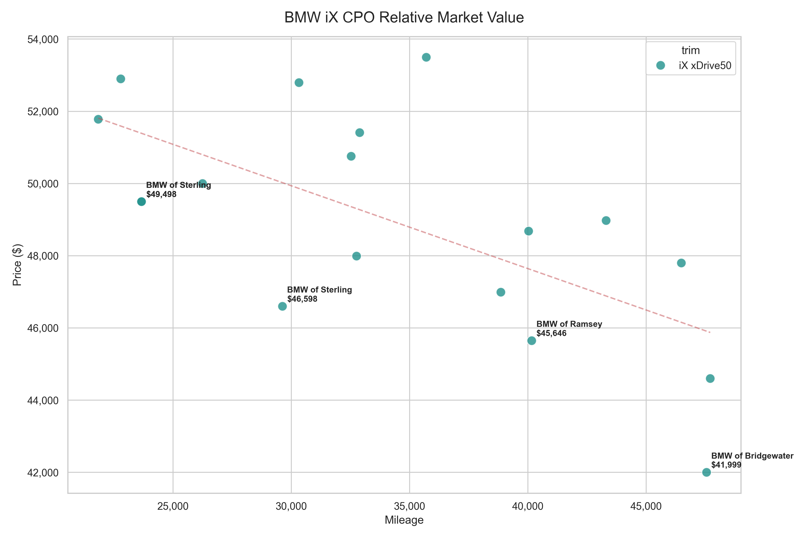

# BMW iX Prospecting Report
*Generated on April 10, 2026*

This report analyzes the active CPO market for BMW iX models within 100 miles of 22015 under $55,000.  
Total Active Prospects Tracked: **18**

## Relative Market Value Matrix
The chart below maps Price vs. Mileage. The red dashed line represents the average market depreciation trend.
**Vehicles plotted below the red line represent higher relative value.**

## Top 5 Best Value Opportunities
These vehicles are priced the furthest below the expected market average for their mileage.

### 2024 BMW iX iX xDrive50 - BMW of Bridgewater
- **Price:** $41,999 *(Est. $3,911 below market average)*
- **Mileage:** 47,555 miles
- **First Seen:** 2026-04-09
- [View Vehicle Listing](https://www.bmwusa.com/certified-preowned-search/detail/WB523CF03RCN15266)

### 2024 BMW iX iX xDrive50 - BMW of Sterling
- **Price:** $46,598 *(Est. $3,425 below market average)*
- **Mileage:** 29,629 miles
- **First Seen:** 2026-04-09
- [View Vehicle Listing](https://www.bmwusa.com/certified-preowned-search/detail/WB523CF03RCN34772)

### 2024 BMW iX iX xDrive50 - BMW of Ramsey
- **Price:** $45,646 *(Est. $1,960 below market average)*
- **Mileage:** 40,164 miles
- **First Seen:** 2026-04-09
- [View Vehicle Listing](https://www.bmwusa.com/certified-preowned-search/detail/WB523CF02RCN27036)

### 2024 BMW iX iX xDrive50 - BMW of Sterling
- **Price:** $49,498 *(Est. $1,892 below market average)*
- **Mileage:** 23,671 miles
- **First Seen:** 2026-04-09
- [View Vehicle Listing]()

### 2024 BMW iX iX xDrive50 - BMW of Sterling
- **Price:** $49,498 *(Est. $1,892 below market average)*
- **Mileage:** 23,671 miles
- **First Seen:** 2026-04-10
- [View Vehicle Listing](https://www.bmwusa.com/certified-preowned-search/detail/WB523CF09RCN06281)

